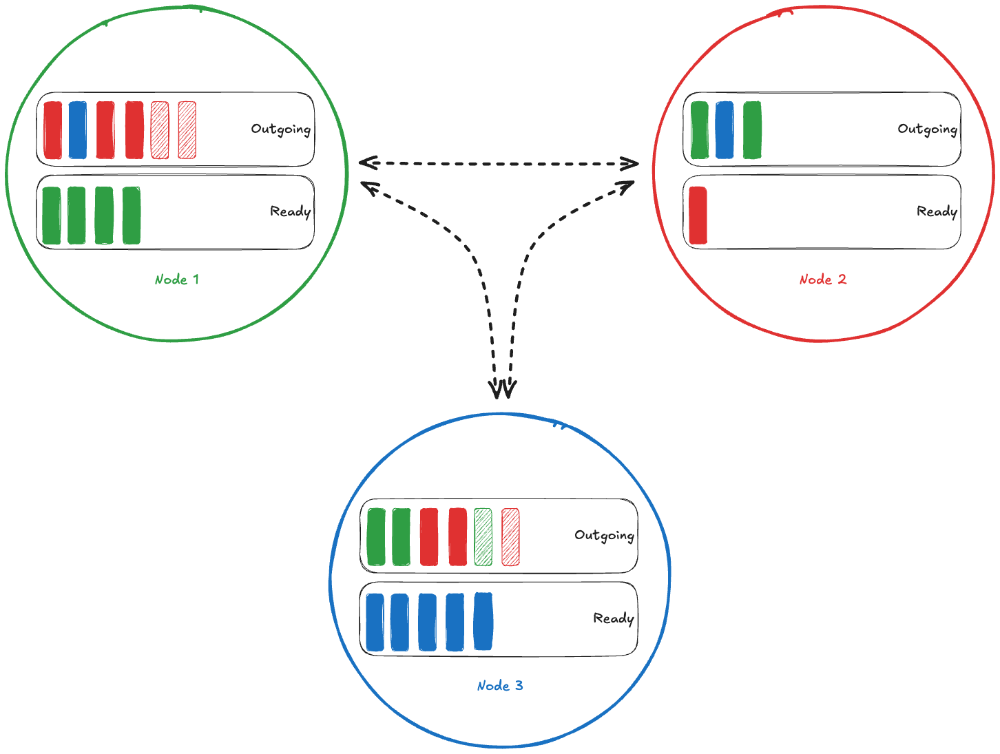
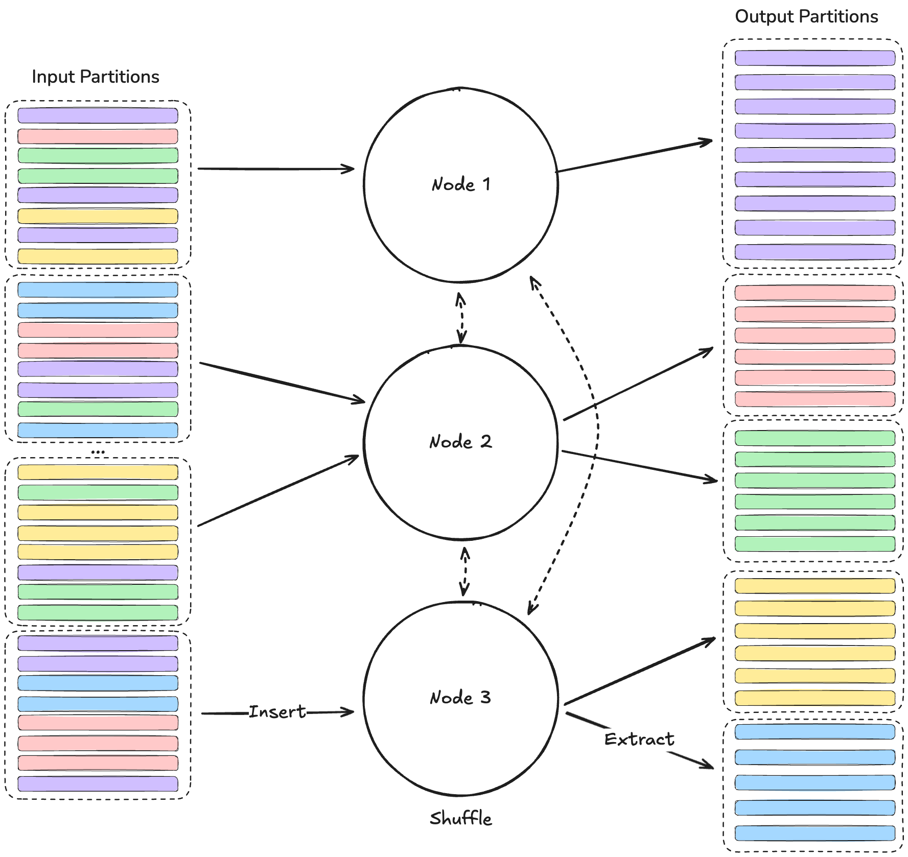

# Shuffle Architecture

`rapidsmpf` uses a "process-per-GPU" execution model. It can be used both
to run on a single GPU or multiple GPUs. These can either be physically
located within the same multi-GPU machine or spread across multiple
machines. The key requirement is that there exist communication links
between the GPUs.

The core abstraction that encapsulates the set of processes that are
executing collectively is a {term}`Communicator`. This provides unique
identifiers (termed {term}`Rank`s) to each process along with message-passing
routes between them. We provide {term}`Communicator` implementations based either
directly on [UCX](https://openucx.org/)/[UCXX](https://github.com/rapidsai/ucxx) or
[MPI](https://www.mpi-forum.org). Message passing handles CPU and GPU data
uniformly, the underlying transport takes care of choosing the appropriate
route.

## "Streaming" collective operations

`rapidsmpf` provides {term}`Collective Operation`s (i.e. communication
primitives) that operate on "streaming" data. As a consequence, a
round of collective communication proceeds in four stages:

1. Participating {term}`Rank`s (defined by the {term}`Communicator`) create a
   collective object.
2. Each {term}`Rank` independently _inserts_ zero-or-more data chunks into the
   collective object.
3. Once a {term}`Rank` has inserted all data chunks, it inserts a _finish marker_.
4. After insertion is finished, a {term}`Rank` can _extract_ data that is the
   result of the collective communication. This may block until data are
   ready.

Collectives over subsets of all {term}`Rank`s in the program are enabled by
creating a {term}`Communicator` object that only contains the desired
participating {term}`Rank`s.

Multiple collective operations can be live at the same time, they are each
distinguished by a `tag`. This `tag` must be consistent across all
participating ranks to line up the messages in the collective.

Notice that we are not responsible for providing the output {term}`Buffer`s that a
collective writes into. This is a consequence of the streaming design: to
allocate output {term}`Buffer`s of the correct size we would first have to see all
inputs. Instead `rapidsmpf` is responsible for allocation of output {term}`Buffer`s
and {term}`Spilling` data from device to host if device memory is at a premium.
However, although `rapidsmpf` allocates outputs it never interprets your
data: it just sends and receives bytes "as-is".

## Shuffles

A key {term}`Collective Operation` in large-scale data analytics is a "shuffle"
(a generalised all-to-all). In a shuffle, every participating {term}`Rank` sends
data to every other {term}`Rank`. We will walk through a high-level overview of the
steps in a shuffle using `rapidsmpf` to see how things fit together.

Having created a collective shuffle operation (a {term}`Shuffler`), at
a high level, a shuffle operation involves these steps:

1. [user code] Each {term}`Rank` *inserts* **chunks** of data to the {term}`Shuffler`,
   followed by a finish marker.
2. [rapidsmpf] The {term}`Shuffler` on that {term}`Rank` processes that chunk by either sending it to
   another {term}`Rank` or keeping it for itself.
3. [user code] Each {term}`Rank` *extracts* chunks of data from each once it's
   ready.

There are more details around how chunks are assigned to output {term}`Rank`s and how memory is
managed. But at a high level, your program is responsible for inserting chunks
somewhere and extracting (the now shuffled) chunks once they've been moved to
the correct {term}`Rank`.

This diagram shows a {term}`Network` with three {term}`Rank`s in the middle of a Shuffle operation.



As your program inserts chunks of data (see below), each chunk is assigned to
a particular {term}`Rank`. In the diagram above, this is shown by color: each
process (recall a process is uniquely identified by a `({term}`Rank`,
{term}`Communicator`)` pair) has a particular color (the color of its circle) and each chunk with that color will
be sent to its matching {term}`Rank`. So, for example, all of the green chunks will be
extracted from the green process in the top-left. Note that the number of different
chunk types (colors in this diagram) is typically larger than the number of {term}`Rank`s,
and so each process will be responsible for multiple output chunk types.

The process you insert the chunk on is responsible for getting the data to the
correct output {term}`Rank`. It does so by placing the chunk in its **Outgoing** message
box and then working to send it (shown by the black lines connecting the processes).

Internally, the processes involved in a shuffle continuously

- receive newly inserted chunks from your program
- move chunks to their intended {term}`Rank`s
- receive chunks from other {term}`Rank`s
- hand off *ready* chunks when your program extracts them

During a shuffle, device memory might run low on one or more processes. `rapidsmpf` is able to *spill* chunks of data from device memory to a
larger pool (e.g. host memory). In the diagram above, this is shown by the
hatched chunks. See {term}`Spilling` for more details.

### Example: Shuffle a Table on a Column

The `rapidsmpf` {term}`Shuffler` operates on **chunks** of data, without really caring
what those bytes represent. But one common use case is shuffling a table on (the
hash of) one or more columns. In this scenario, `rapidsmpf` can be used as part
of a Shuffle Join implementation.

This diagram shows multiple {term}`Rank`s working together to shuffle a large, logical
Table.



Suppose you have a large logical table that's split into a number of {term}`Partition`s.
In the diagram above, this is shown as the different dashed boxes on the
left-hand side. In this example, we've shown four {term}`Partition`s, but this could be
much larger. Each row in the table is assigned to some group (by the hash of the
columns you're joining on, say), which is shown by the color of the row.

Your program **inserts** data to the {term}`Shuffler`. In this case, it's inserting
chunks that represent pieces of the table that have been partitioned (by hash
key) and packed into a chunk.

Each {term}`Rank` involved in the shuffle knows which {term}`Rank`s are responsible for which
hash keys. For example, {term}`Rank` 1 knows that it's responsible for the purple
chunks, needs to send red chunks to {term}`Rank` 2, etc.

Each input {term}`Partition` possibly includes data for each hash key. All the processes
involved in the shuffle move data to get all the chunks with a particular hash
key to the correct {term}`Rank` ({term}`Spilling` if needed). This is shown in the middle
section.

As chunks become "ready" (see above), your program can **extract** chunks and
process them as necessary. This is shown on the right-hand side.

### NVTX Annotations

rapidsmpf includes [nvtx](https://github.com/NVIDIA/NVTX) annotations to provide context
when viewing an [NSight Systems](https://developer.nvidia.com/nsight-systems) report.

For example, if you have a program `spill.py` that uses rapidsmpf, you can run
it under nsys to capture a report:

```
$ nsys profile -o spill --trace cuda,nvtx \
   python -m rapidsmpf.benchmarks.streaming_benchmark --spill-device '1MiB' --out-nparts 4 --part-size 1MiB --local-size 24MiB
```

The `rapidsmpf.report` command line interface can analyze the rapidsmpf
statistics from that report:

```
$ python -m rapidsmpf.report spill.nsys-rep
Postbox Spilling Summary
================================================================================

         Metric |        Avg |        Std |      Min |        Max |     Total
----------------+------------+------------+----------+------------+----------
       Duration |  491.73 µs |  304.51 µs |  1.15 µs |    1.15 ms |  25.08 ms
Bytes requested | 266.96 KiB | 125.07 KiB | 288.00 B | 514.04 KiB | 13.30 MiB
  Bytes spilled | 341.33 KiB | 221.21 KiB |      0 B | 768.00 KiB | 17.00 MiB

Spill count:  51
Spill satisfaction: 127.9%
Effective throughput: 677.88 MiB/s
```
