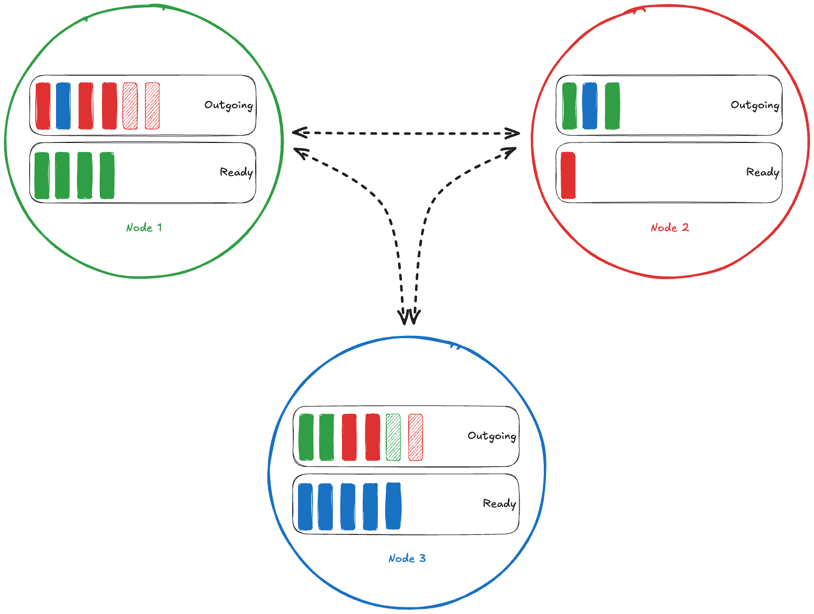
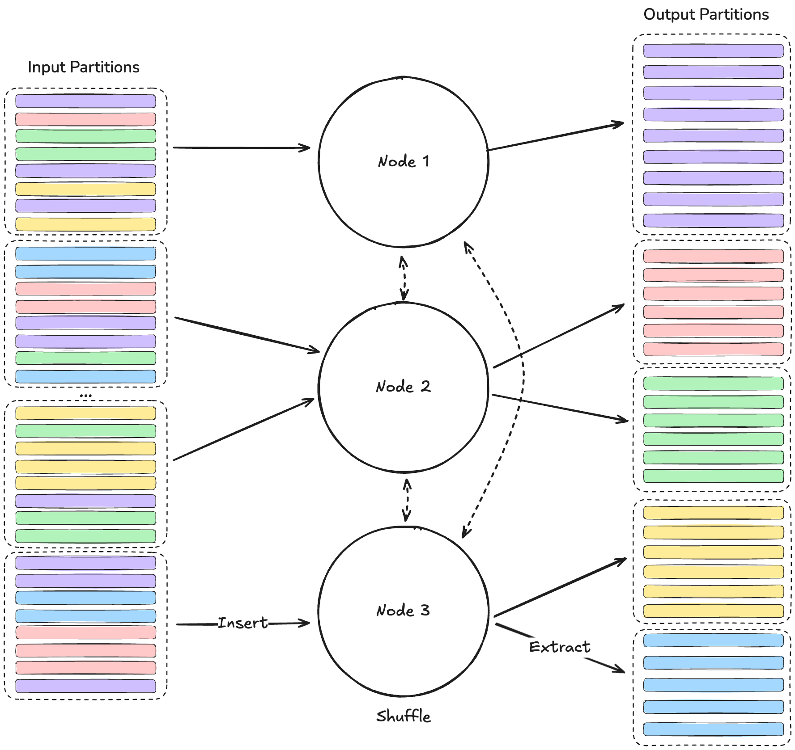

## Architecture

`rapidsmpf` uses a network of **nodes** to process data. Typically you'll have
one `rapidsmpf` node per GPU. You might form a rapidsmpf network on a single
machine with multiple GPUs, or from multiple machines, each with one or more
GPUs.

All nodes in the network can pass messages and data to each other using an
underlying communication transport like [UCX](https://openucx.org/) or MPI.
Nodes work together to perform an operation like a Shuffle.

At a high level, a shuffle operation involves these steps:

1. Your program *inserts* **chunks** of data to the Shuffler on each node.
2. The Shuffler on that node processes that chunk by either sending it to
   another node or keeping it for itself.
3. Your program *extracts* chunks of data from each node once it's ready

There are more details around how chunks are assigned to nodes and how memory is
managed. But at a high level, your program is responsible for inserting chunks
somewhere and extracting (the now shuffled) chunks once they've been moved to
the correct node.

Nodes shuffle **chunks** of data. These are arbitrary batches of bytes that have
somehow been assigned to be processed by a specific node. Shuffling a table on
the hash of one or more columns is just one example use case that `rapisdmpfs`
serves.

### Shuffle

This diagram shows a network of with three nodes in the middle of a Shuffle operation.

As your program inserts chunks of data into a node (see below), it's assigned to
a particular node. In the diagram above, this is shown by color: each node has a
particular color (the color of its circle) and each chunk with that color will
be sent to its matching node. So, for example, all of the green chunks will be
extracted from the green ndoe in the top-left. Note that the number of different
chunk types (colors in this diagram) is typically larger than the number of nodes,
and so each node will be responsible for multiple output chunk types.

The node you insert the chunk into is responsible for getting the data to the
correct output node. It does so by placing the chunk in its **Outgoing** message
box and then working to send it (shown by the black lines connecting the nodes).

Internally, the nodes involved in a shuffle continuously

- receive newly inserted chunks from your program
- move chunks to their intended nodes
- receive chunks from other nodes
- hand off *ready* chunks when your program extracts them

During a Shuffle, device memory might run low on more or more nodes in the
network. `rapidsmpf` is able to *spill* chunks of data from device memory to a
larger pool (e.g. host memory). In the diagram above, this is shown with the
hatched chunks.

### Example: Shuffle a Table on a Column

The `rapidsmpf` Shuffler operates on **chunks** of data, without really caring
what those bytes represent. But one common use case is shuffling a table on (the
hash of) one or more columns. In this scenario, `rapidsmpf` can be used as part
of a Shuffle Join implementation.

This diagram shows multiple nodes working together to shuffle a large, logical
Table.

Suppose you have a large logical table that's split into a number of partitions.
In the diagram above, this is shown as the different dashed boxes on the
left-hand side. In this example, we've shown four partitions, but this could be
much larger. Each row in the table is assigned to some group (by the hash of the
columns you're joining on, say), which is shown by the color of the row.

Your program **inserts** data to the shuffler. In this case, it's inserting
chunks that represent pieces of the table that have been partitioned (by hash
key) and packed into a chunk. Each partition inserts its data into one of the
nodes, typically the node running on the same GPU as the in-memory partition.

Each node involved in the shuffle knows which nodes are responsible for which
hash keys. For example, Node 1 knows that it's responsible for the purple
chunks, needs to send red chunks to Node 2, etc.

Each input partition possibly includes data for each hash key. All the nodes
involved in the shuffle move data to get all the chunks with a particular hash
key on the correct node (spilling if needed). This is shown in the middle
section.

As chunks become "ready" (see above), your program can **extract** chunks and
process them as necessary. This is shown on the right-hand side.

## Shuffle Statistics

Shuffles can be configured to collect statistics, which can help you understand the performance of the system.
This table gives an overview of the different statistics collected.

| Name | Type | Description |
| --- | --- | --- |
| `spill-bytes-device-to-host` | int | The size in bytes of data moved from device to host when spilling data. |
| `spill-time-device-to-host` | float | The duration of the device to host spill. The unit is platform dependent. |
| `spill-bytes-host-to-device` | int | The size in bytes of data moved from host to device when unspilling data. |
| `spill-time-host-to-device` | float | The duration of the host to device spill. The unit is platform dependent. |
| `spill-bytes-recv-to-host` | int | The size in bytes of data received into host memory on one node from some other node. |
| `shuffle-payload-send` | int | The size in bytes of data transferred from a node (including locally, from a node to itself). |
| `shuffle-payload-recv` | int | The size in bytes of data transferred to a node (including locally, from a node to itself). |
| `event-loop-total` | float | The duration of a Shuffler's event loop iteration. The unit is platform dependent. |
| `event-loop-metadata-send` | float | The duration of sending metadata from one node to another. The unit is platform dependent. |
| `event-loop-metadata-recv` | float | The duration of receiving any outstanding metadata messages from other nodes. The unit is platform dependent. |
| `event-loop-post-incoming-chunk-recv` | float | The duration of posting receives for any incoming chunks from other nodes. The unit is platform dependent. |
| `event-loop-init-gpu-data-send` | float | The duration of receiving ready-for-data messages and initiating data send operations. The duration of the actual data transfer is not captured by this statistic. The unit is platform dependent. |
| `event-loop-check-future-finish` | float | The duration spent checking if any data has finished being sent. The unit is platform dependent. |

Statistics are available in both C++ and [Python](#api-statistics).